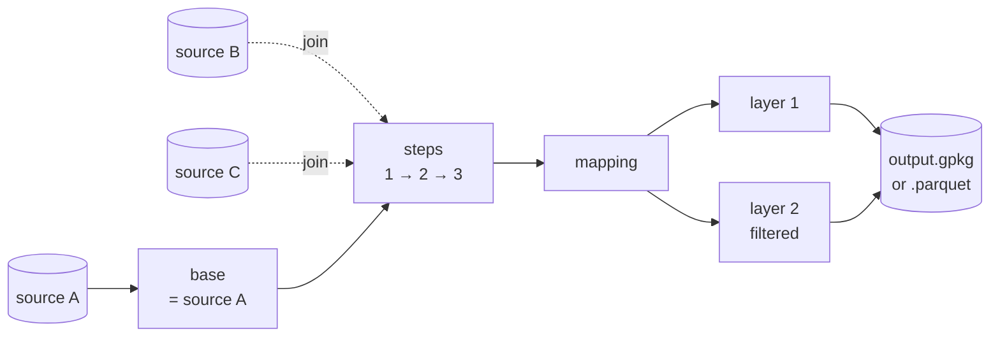
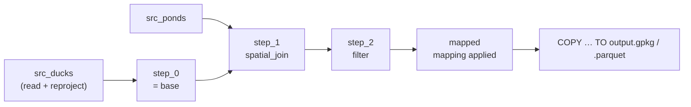

# Core concepts

A duck soup pipeline answers five questions, always in the same order:

1. **Sources**: where does the data come from?
2. **Base**: which source's features become the output rows?
3. **Steps**: how do those rows get enriched, filtered or reshaped?
4. **Mapping**: which columns come out, named what?
5. **Layers**: where is the result written, in which CRS?



## Config, pipelines and the shared output

A YAML file is a **config**. It names one output (a **GeoPackage**, or **GeoParquet** when the
path ends in `.parquet`) and holds one or more
**pipelines**:

```yaml
name: pond_survey
output: output/pond_survey.gpkg  # every pipeline writes into this one file
overwrite: true                  # delete the file before writing (default)
pipelines:
  - name: ducks
    # sources / base / steps / mapping / layers …
  - name: nests
    # … a completely independent chain
```

Pipelines don't share anything except the output file. Each has its own sources, base, steps
and mapping, and writes its own layers. Use several pipelines when you want several unrelated
layers in one deliverable.

## Sources

A source is a dataset with an `id` you refer to elsewhere. It has a `format`, a `uri` (file
path, folder, URL or connection string) and usually a `layer` and `crs`:

```yaml
sources:
  - id: ponds
    format: gpkg
    uri: data/ponds.gpkg
    layer: ponds
    crs: EPSG:32631
```

Every source is read once. Invalid geometry is repaired on load (`make_valid`, on by default),
optionally flattened to 2D (`force_2d`), and reprojected into the pipeline's working CRS. Tabular sources (CSV, Excel, JSON, or anything with
`geometry: false`) can still be used for attribute joins and codelists. See
[Source formats](reference/sources.md) for every format.

## The base

`base` names the source whose features flow through the pipeline. **One base feature in = one
output row out**, unless a step deliberately changes the row count (a `filter`, a `merge`, a
`dissolve`, a `spatial_join` with `match: all`, an `intersect_overlay`, a `line_overlay`).

Every other source is reference data. Steps join it onto the base rows, but it never becomes
output rows on its own.

## Steps

Steps run in order. Each step takes the rows produced so far and returns a new set of rows:

- **Joins** add columns: `spatial_join`, `attribute_join`, `nearest_neighbor`, `intersect_overlay`, `line_overlay`.
- **Geoprocessing** changes the geometry: `buffer`, `centroid`, `clip`, `erase`, `dissolve`.
- **Row operations** change which rows exist: `filter`, `merge`.
- **`snapshot`** names the current state so later steps can refer back to it.

Each join step pulls specific columns from the joined source through `fields`, written as
`{new_name: source_column}`. Only those columns are added.

See [Step types](reference/steps.md) for the full list.

## Mapping

The mapping is the output schema: an ordered list of output columns, each filled from exactly
one of these:

| kind | example | meaning |
|---|---|---|
| `from` | `{to: name, from: duck_name}` | copy a column |
| `const` | `{to: source, const: "Annual Duck Census"}` | a fixed value |
| `expr` | `{to: label, expr: "upper(duck_name)"}` | any DuckDB SQL expression |
| `func` | `{to: id, func: uuid}` | a built-in: `uuid`, `now`, `today`, `lon`, `lat`, `mgrs`, `wkb`, `area`, `length` |
| `codelist` | see [Codelists](reference/mapping.md#codelists) | translate codes via rules or a CSV |

Any of them can add `cast: INTEGER` (or another SQL type). The geometry column is always
written automatically as `geom`, so don't map it yourself. **With no mapping at all, every
column is written as-is.**

## Layers

A pipeline writes one or more **layers** into the shared output. Every layer gets the same
rows, and each layer can:

- reproject to its own `crs`,
- keep only some rows with a `filter` (a SQL condition),
- override the pipeline mapping with its own `mapping`.

```yaml
layers:
  - {layer: ducks,           crs: EPSG:32631}
  - {layer: ducks_off_pond,  crs: EPSG:32631, filter: "pond IS NULL"}
```

## The working CRS

All joins and geoprocessing happen in one CRS, the **working CRS**. Every source is
reprojected into it when read, and each layer is reprojected out of it when written.

- If you don't set `working_crs`, it defaults to the base source's CRS.
- Buffer distances, `max_distance`, `distance_field`, and the `area`/`length` functions are all
  in working-CRS units. duck soup **refuses to run** these in a geographic (degree) CRS such
  as EPSG:4326, because "buffer 500" would mean 500 degrees. Pick a projected CRS in metres
  (for example the UTM zone covering your data, such as EPSG:32633 for UTM zone 33N).
- `lon`, `lat` and `mgrs` are always computed in EPSG:4326 from the centroid, whatever the
  working CRS is.

## Branches and derived sources

A pipeline isn't strictly linear. There are two ways to fork it.

**Derived sources** are filtered or buffered views of a source, which you can join against
like any other source:

```yaml
derived_sources:
  - id: deep_ponds
    from: ponds
    where: "depth_m > 2"   # only the ponds deep enough for diving ducks
    buffer: 10             # optional, working-CRS units: include the reedy edge
```

**Snapshots** name the chain's state partway through, so a later step can join against
the processed rows (`source: my_snapshot`). Steps can also keep working on that branch
(`branch: my_snapshot`) while the main chain carries on unchanged. Output layers are always
written from the **main** chain, so a branch is only useful as the `source:` of a later step.

This example finds, for every duck, the other ducks within 50 m (its flockmates):

```yaml
base: ducks
steps:
  - {type: snapshot, id: personal_space}                  # copy the current rows to a branch
  - {type: buffer, distance: 50, branch: personal_space}  # buffer the copy, not the main chain
  - type: spatial_join                                    # main chain: still duck points
    source: personal_space
    predicate: within
    match: all                                            # one row per circle the duck is in
    fields: {flockmate: name}                             # (each duck also matches its own circle)
```

The [snapshot tutorial](tutorials/steps.md#snapshot) walks through a similar example step by
step.

## How it runs

Under the hood, a pipeline compiles to a chain of DuckDB SQL views:



DuckDB plans the whole chain as one query, so data streams through without intermediate
files. Spatial joins use DuckDB's R-tree spatial join, which keeps large point-in-polygon
joins fast.
