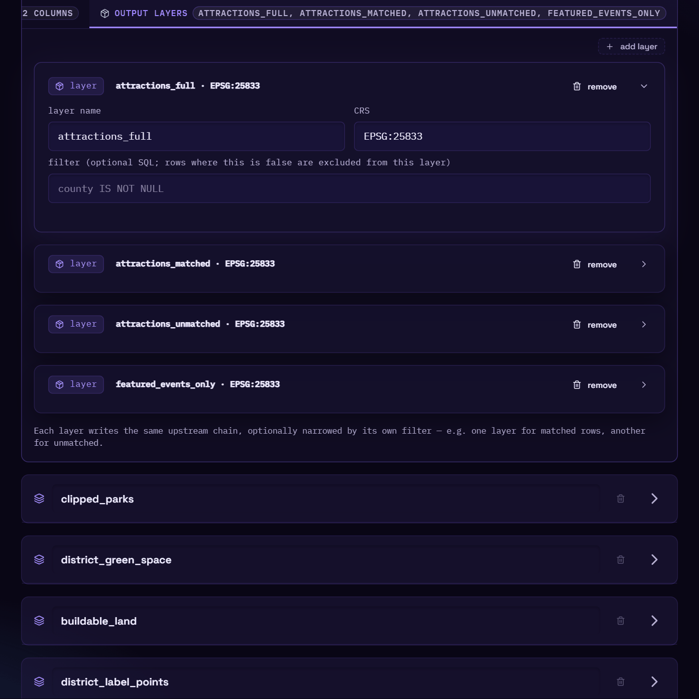
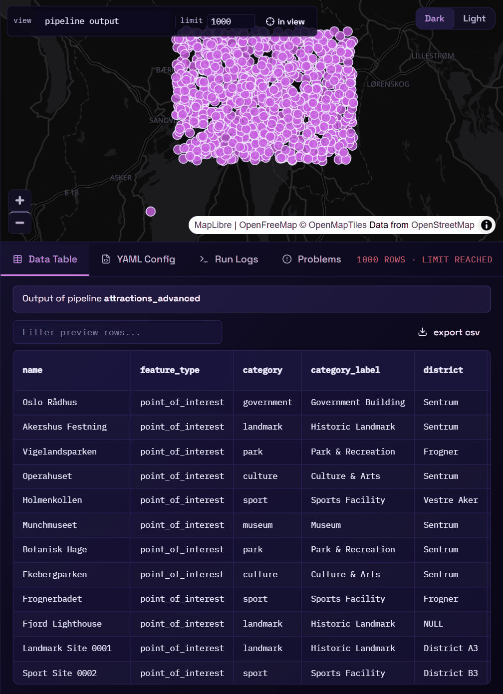
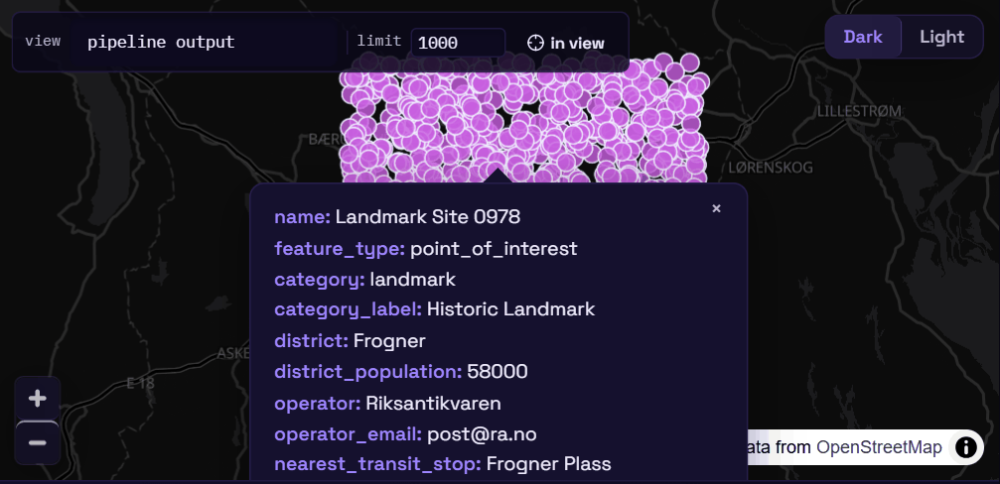
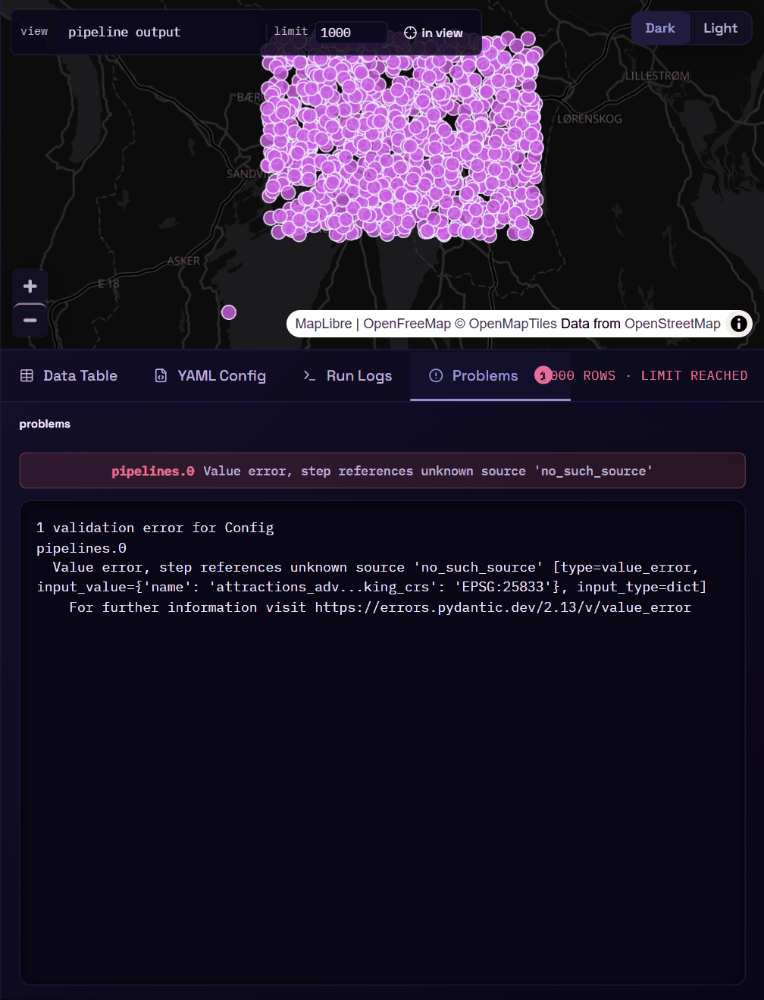
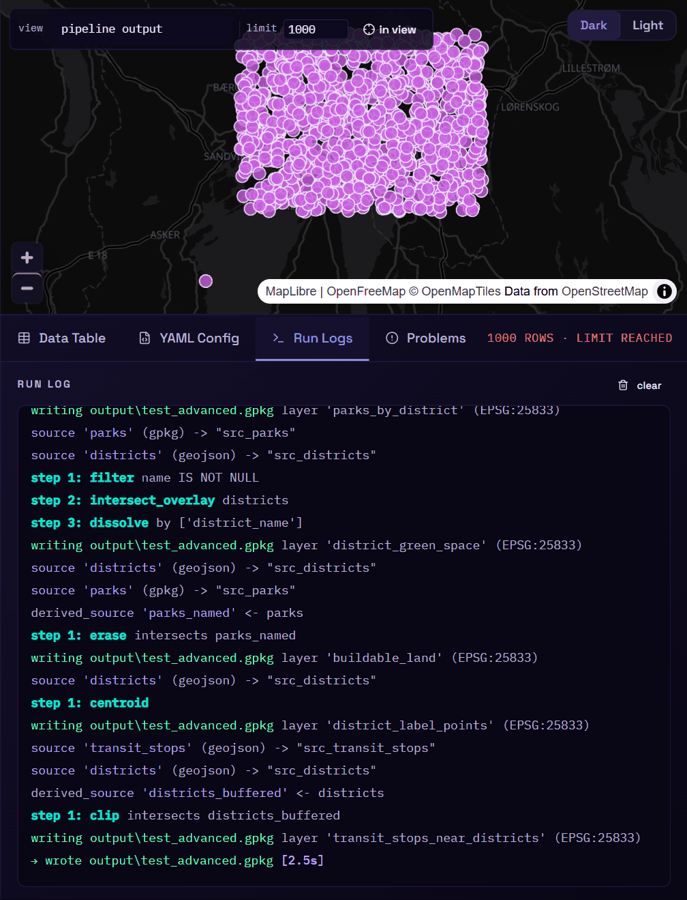
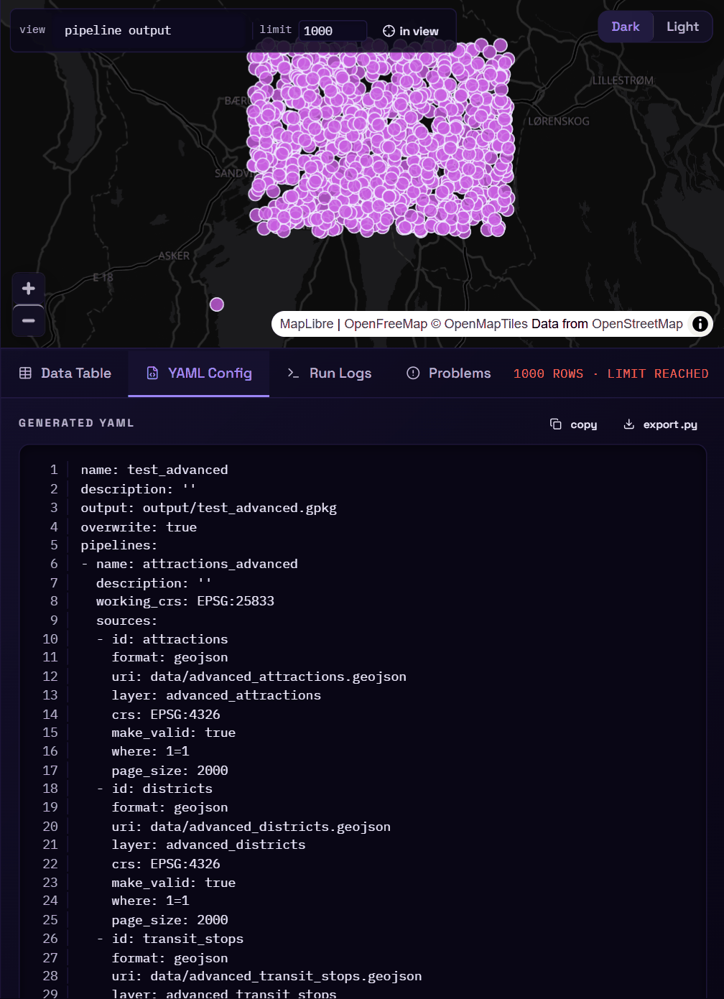

# Preview, validate & run

## Output layers

The **output layers** tab of each pipeline lists the layers it writes into the shared
output. Each layer card has:

- **layer name**: the table name inside the GeoPackage (for a multi-layer GeoParquet output,
  the file name).
- **CRS**: the CRS geometry is reprojected to on write.
- **filter**: an optional SQL condition. Rows where it's false are left out of *this* layer
  only. A live check under the field tells you whether it parses.

{ .screenshot loading=lazy }

All layers of a pipeline get the same rows, so filters are how you split them. For example, a
`stations` layer with no filter and a `stations_outside_county` layer with
`county IS NULL`.

!!! note "Filters use upstream column names"
    A layer filter runs **before** the mapping, so it refers to the column names coming out of
    the last step (`county`, `s_pond_type`), not the renamed output columns.

!!! info "Per-layer mapping is YAML-only"
    In YAML a layer can carry its own `mapping:` that replaces the pipeline mapping for that
    layer. The editor doesn't show it yet. See [Pipeline YAML](../reference/yaml.md#layers).

## Automatic validation and preview

You don't need to click anything to see your work. About a quarter of a second after each
change, the editor:

1. **validates** the config against the same schema the CLI uses. The status indicator turns
   `valid` or shows the error.
2. if it's valid, **previews** it. The map and the **Data Table** show the first rows of the
   current pipeline's output.

The preview follows whichever pipeline card you're working in. Steps and sources can also be
previewed on their own:

| To see… | Do this |
|---|---|
| the final output (mapping applied) | the default; or pick *pipeline output* in the map's **view** dropdown |
| one source, raw | pick it in the **view** dropdown |
| the base before any steps | the eye button in the **sources** tab |
| the rows after a given step | the eye button on that step card |

A banner above the table says what you're looking at, with a **Show pipeline output** button
to go back.

### Map toolbar

{ .screenshot .narrow loading=lazy }

- **view**: pipeline output, or any single source.
- **limit**: how many features to fetch (1–20 000, default 1 000). The table shows
  *limit reached* when there may be more.
- **in view**: preview only features inside the current map extent, rather than the first N.
  While it's on, panning or zooming re-runs the preview. Use it to inspect one area of a big
  dataset.
- **Light / Dark**: switch the basemap. It follows the editor's theme by default; this overrides it until the next theme toggle.

Click a feature to see all its attributes in a popup:

{ .screenshot .narrow loading=lazy }

### Data Table

The table shows the same rows as the map (geometry hidden). Click a column header to sort, and
type in the filter box to search all columns. **export csv** downloads what's shown.

## Problems

When the config is invalid, the **Problems** tab opens and its badge shows the number of
errors. Each problem shows the location (`pipelines.0.steps.2.source`) and the message. Click
one to jump to the card it refers to: the editor expands it, scrolls to it and flashes it.

{ .screenshot .narrow loading=lazy }

Errors come from the same validation as `duck-soup check`, so a config that's valid in the
editor is valid on the command line.

## Saving

**save** (<kbd>Ctrl</kbd>+<kbd>S</kbd>) writes `pipelines/<save as>.yaml` in the
[project folder](../getting-started/install.md#where-the-editor-keeps-your-files). The
editor asks before overwriting a *different* config that already has that name.

The file is plain YAML: commit it, diff it, run it with `duck-soup run`, or load it back
later from the **load** dropdown.

## Running

**run** (<kbd>Ctrl</kbd>+<kbd>Enter</kbd>) runs every pipeline in the config and writes the
output. While it runs, the button shows elapsed seconds. When it finishes, the
**Run Logs** tab shows:

- each source being read and each step being built, with timings,
- `→ wrote output/xyz.gpkg [12.3s]` on success,
- the error and the last lines of the traceback on failure.

{ .screenshot .narrow loading=lazy }

New runs are appended under a divider so you can compare them. **clear** empties the log.

!!! warning "Runs are synchronous"
    A run is a single request: the log fills in when it completes, and there's no cancel
    button. For long jobs, consider the command line or an exported script.

## YAML Config tab

This tab shows the YAML the editor would save, with line numbers. Use it to learn the format,
or to copy the config somewhere else.

{ .screenshot .narrow loading=lazy }

- **copy** puts the YAML on the clipboard.
- **export .py** downloads a standalone Python script with the pipeline embedded. Run it with
  `python my_pipeline.py` on any machine with `duck-soup-etl` installed: no server or editor
  needed. Relative paths resolve against the folder you run it from.

## Import

**import** in the top bar opens a box to paste a full pipeline YAML. It's parsed and validated
on the server, then replaces what's open in the editor (you're asked first if you have unsaved
changes). Save it to keep it.
